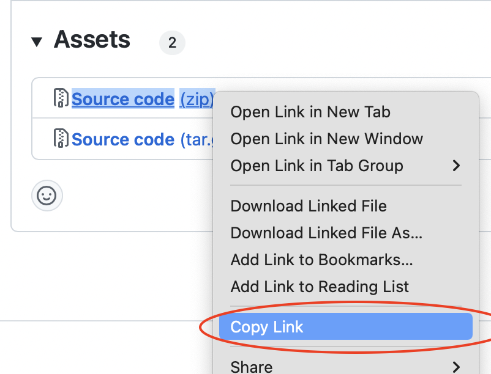

# Defold AdMob extension API documentation

This extension provides a unified and simple to use interface to show AdMob Ads on iOS and Android.


## Installation
To use this extension in your Defold project, add one of the available release URLs to your `game.project` dependencies and then fetch libraries using `Project->Fetch Libraries`:

[https://github.com/defold/extension-admob/releases](https://github.com/defold/extension-admob/releases).




## Setup

Before you begin you need to either [sign in](https://admob.google.com/home/) to or [sign up for](https://support.google.com/admob/answer/7356219) an AdMob account. Next you need to [register your app with AdMob](https://support.google.com/admob/answer/2773509) to get an AdMob App Id. You need this id when you configure your Defold game.


## Configuration
The extension can be configured by adding the following fields to `game.project` ( just open this file in any text editor and paste these lines):

```
[admob]
app_id_ios = ca-app-pub-3940256099942544~1458002511
app_id_android = ca-app-pub-3940256099942544~3347511713
ios_tracking_usage_description = Your data will be used to provide you a better and personalized ad experience.
```

### app_id_ios
This is your iOS AdMob app ID. An app ID is a unique ID number assigned to your apps when they're added to AdMob. The app ID is used to identify your apps.

### app_id_android
This is your Android AdMob app ID. An app ID is a unique ID number assigned to your apps when they're added to AdMob. The app ID is used to identify your apps.

### ios_tracking_usage_description

Before requesting the unique IDFA string for a device on iOS 14 the application must request user authorization to access app-related data for tracking the user or the device. This is done automatically when `admob.request_idfa()` is called. The string set in `admob.ios_tracking_usage_description` will be shown to the user.

Apple documentation: https://developer.apple.com/documentation/apptrackingtransparency?language=objc


## Usage

### Setup
To start using AdMob in Defold you need to first set-up an AdMob callback and configure privacy settings:

```lua
-- `admob` works only on iOS and Android, make sure the extension is available
if admob then
    -- Set callback before initialization
    admob.set_callback(admob_callback)
    
    -- Read documentation about privacy settings and use the following method if you need to apply it
    -- https://developers.google.com/admob/ios/ccpa
    -- https://developers.google.com/admob/android/ccpa
    admob.set_privacy_settings(true)
end
```

The callback function is used by AdMob to forward events generated as a result of using the various features of the SDK.

```lua
local function admob_callback(self, message_id, message)
    -- handle messages from admob
end
```


### Request IDFA
On iOS you should also consider asking the user for permission to use an Identifier for Advertisers (IDFA) to be able to deliver personalized ads. You can present the user with an authorization request by calling the `request_idfa()` function:

```lua
-- Display the App Tracking Transparency authorization request for accessing the IDFA
admob.request_idfa()
```

The result of the authorization request will be received in the callback function:

```lua
local function admob_callback(self, message_id, message)
    if message_id == admob.MSG_IDFA then
        if message.event == admob.EVENT_STATUS_AUTHORIZED then
            print("ATTrackingManagerAuthorizationStatusAuthorized")
        elseif message.event == admob.EVENT_STATUS_DENIED then
            print("ATTrackingManagerAuthorizationStatusDenied")
        elseif message.event == admob.EVENT_STATUS_NOT_DETERMINED then
            print("ATTrackingManagerAuthorizationStatusNotDetermined")
        elseif message.event == admob.EVENT_STATUS_RESTRICTED then
            print("ATTrackingManagerAuthorizationStatusRestricted")
        elseif message.event == admob.EVENT_NOT_SUPPORTED then
            print("IDFA request not supported on this platform or OS version")
        end
    ...
end
```


### Initialization
Next step is to initialize the Mobile Ads SDK. Note that if you need to obtain consent from users in the European Economic Area (EEA), set any request-specific flags, or otherwise take action before loading ads, ensure you do so before initializing the Mobile Ads SDK.

```lua
admob.initialize()
```

The callback function will be invoked once the SDK has been initialized or if something went wrong during initialization:

```lua
local function admob_callback(self, message_id, message)
    if message_id == admob.MSG_INITIALIZATION then
        if message.event == admob.EVENT_COMPLETE then
            print("Initialization complete")
        elseif message.event == admob.EVENT_JSON_ERROR then
            print("Internal json error: ".. message.error)
        end
    end
```


### Loading ads

Before an ad unit can be displayed it has to be loaded:

```lua
admob.load_interstitial(ad_unit)
admob.load_rewarded(ad_unit)
admob.load_banner(ad_unit, size)
```

The callback function will be invoked when the ad unit is ready:

```lua
local function admob_callback(self, message_id, message)
    if message_id == admob.MSG_INTERSTITIAL then
        if message.event == admob.EVENT_FAILED_TO_LOAD then
            print("Code: "..message.code .. " Error: " .. message.error)
        elseif message.event == admob.EVENT_LOADED then
            print("Loaded")
        elseif message.event == admob.EVENT_JSON_ERROR then
            print("Internal error: " .. message.error)
        end
    elseif message_id == admob.MSG_REWARDED then
        -- same as above
    elseif message_id == admob.MSG_BANNER then
        -- same as above
    end
```

It is also possible to query if an ad type is loaded and ready to show:

```lua
admob.is_banner_loaded()
admob.is_interstitial_loaded()
admob.is_rewarded_loaded()
```


### Showing ads
Once an ad unit has been loaded it is ready to be shown:

```lua
admob.show_interstitial()
admob.show_rewarded()
admob.show_banner(position)
```

The callback function will be invoked when the ad unit is shown:

```lua
local function admob_callback(self, message_id, message)
    if message_id == admob.MSG_INTERSTITIAL then
        if message.event == admob.EVENT_CLOSED then
            print("Ad is closed")
        elseif message.event == admob.EVENT_FAILED_TO_SHOW then
            print("Ad failed to show. Code: " .. message.code .. ". Error: " .. message.error)
        elseif message.event == admob.EVENT_OPENING then
            print("Ad is opening")
        elseif message.event == admob.EVENT_IMPRESSION_RECORDED then
            print("Ad did record impression")
        elseif message.event == admob.EVENT_CLICKED then
            print("Ad is clicked")
        elseif message.event == admob.EVENT_JSON_ERROR then
            print("Internal error: " .. message.error)
        end
    elseif message_id == admob.MSG_REWARDED then
        -- same as above
    elseif message_id == admob.MSG_BANNER then
        -- same as above
    end
```

Banner ads can be hidden and destroyed:

```lua
admob.hide_banner()
admob.destroy_banner()
```


## Example

[Refer to the example project](https://github.com/defold/extension-admob/blob/master/main/ads.gui_script) to see a complete exameple of how the intergation works.

Make sure you test the example and you integration using test Ad units (see [init()](https://github.com/defold/extension-admob/blob/28452b6b49c6304b274a80070279768f89cab8ac/main/ads.gui_script#L157-L183) in the example)


## Source code

The source code is available on [GitHub](https://github.com/defold/extension-admob)


## API reference
